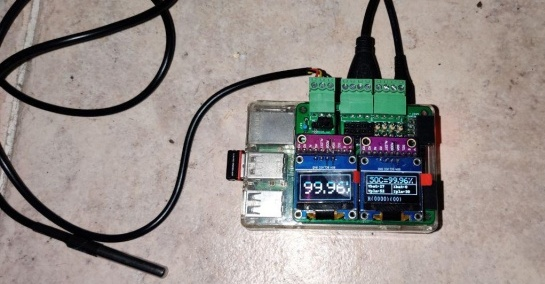

# Instalación HW

- [Instalación HW](#instalación-hw)
  - [Introducción](#introducción)
  - [Diagramas de Instalación](#diagramas-de-instalación)
    - [Instalación con Hibrido tipo Axpert](#instalación-con-hibrido-tipo-axpert)
    - [Instalación con Hibrido tipo Axpert con shunt](#instalación-con-hibrido-tipo-axpert-con-shunt)
    - [Instalación Genérica con Regulador e Inversor](#instalación-genérica-con-regulador-e-inversor)
  - [1.3. Material HW necesario](#13-material-hw-necesario)
    - [Raspberry](#raspberry)
    - [Placa Base (en caso de no capturar desde los equipos)](#placa-base-en-caso-de-no-capturar-desde-los-equipos)
    - [PCF8574P](#pcf8574p)
    - [ADS1115](#ads1115)
    - [Divisores de tensión (resistencias)](#divisores-de-tensión-resistencias)
    - [Sensor de Temperatura DS18B20](#sensor-de-temperatura-ds18b20)
    - [Conector a la Raspberry](#conector-a-la-raspberry)
  - [Montaje en Protoboard](#montaje-en-protoboard)

## Introducción

PVControl+ se ha diseñado con el objetivo de servir a múltiples tipos de
instalaciones FV, por lo que permite monitorizar y controlar diversos
equipamientos FV con o sin batería (Victron, Goodwe, Fronius, Eastron,
SMA, Huawei, Axpert...)

No obstante, lo más genérico es considerar una instalación simple
estándar de FV en donde se tienen Placas, Regulador e Inversor

Por tanto hay configuraciones de PVControl+ que están ligadas a algún
equipamiento especifico (Hibridos Axpert. Monitores baterías Victron,
BMS Daly, etc), que permiten minimizar el HW necesario para la
monitorización mediante la conexión a dichos dispositivos y leer datos
de los mismos (Voltaje batería, Watios consumidos, Voltaje celdas, etc),
la idea inicial es poder leer los datos relevantes de una instalación FV
independientemente del equipamiento que se tenga.

Un esquema básico de la instalación FV sería el siguiente:

Como se observa la idea básica es poder medir:

-   Voltaje de batería: Vbat

-   Intensidad que entra o sale de la batería; Ibat

-   Intensidad que sale del regulador : Iplaca

Adicionalmente se ha pensado en poder medir otros parámetros relevantes

-   Temperatura de las Baterías

-   Voltaje de las placas: Vplaca

-   Salida auxiliar del regulador: Vaux (disponible en muchos
    reguladores)

-   Voltaje de cada celda de la Batería: Vcelda1, Vcelda2, ...

-   Otras magnitudes que con un sensor se pueda pasar el valor a voltaje

**Es importante señalar que NO hace falta instalar todas las
posibilidades de PVControl+, solo lo que se necesite.**

## Diagramas de Instalación

Se dibujan a continuación unos diagramas "tipo" de distintas
instalaciones posibles dependiendo de la configuración que cada uno
tenga

No se especifican todas las posibilidades (instalaciones sin batería,
etc) que permite PVControl+ y que en ese caso suele ser simplemente
conectar el cable de comunicaciones entre en equipo y la Rpi

Tampoco se especifican todas las posibilidades de la PCB (medición de
cada celda, control de reles, etc) pero da una idea básica de la
instalación necesaria

**Por simplificar el dibujo, NO se incluyen en los diagramas las
protecciones (Fusibles, etc) que se deben poner en la instalación y que,
normalmente ya estarán puestas cuando se instala PVControl+**

### Instalación con Hibrido tipo Axpert

Esta es la instalación más simple dado que los datos se capturan desde
el propio Hibrido por lo que solo hace falta un cable USB entre la RPi y
el Hibrido

No es estrictamente necesario alimentar la RPi desde las baterías con un
convertidor DC-DC , se puede utilizar un cargador AC/DC estándar, aunque
por seguridad es la mejor opción

### Instalación con Hibrido tipo Axpert con shunt

Si se quiere tener una medida mas exacta de la intensidad que se carga o
descarga de la batería (Ibat) y por tanto tener el SOC con mayor
precisión se puede incoporar la PCB de PVControl+ junto con un shunt
para medir esta intensidad

La PCB, dependiendo de la configuración que se ponga, permite ademas
controlar hasta 32 Reles, sensores de temperatura y poder medir el
voltaje de hasta 32 celdas

Igualmente recomiendo alimentar la RPi desde las baterías con un
convertidor DC-DC ,

### Instalación Genérica con Regulador e Inversor

Es la instalación mas genérica en donde los valores de la FV (Vbat,
Ibat, Iplaca, etc) se capturan desde la PCB por tanto es independiente
del equipamiento instalado

Como hemos comentado la PCB, dependiendo de la configuración que se
ponga, permite controlar hasta 32 Reles, sensores de temperatura y poder
medir el voltaje de hasta 32 celdas

Igualmente recomiendo (yo diría que en este caso es casi obligatorio)
alimentar la RPi desde las baterías con un convertidor DC-DC ,

## 1.3. Material HW necesario

###  Raspberry

-   Una Raspberry Pi(Rpi) al menos en versión 3 o 4 con una micro SD de
    8GB o superior (dados los importes actuales yo recomiendo al menos
    32GB y **microSD de tipo A2**

    

-   Alimentador de la Rpi \...aquí podemos
    optar por un alimentador desde 220VAC (útil para ponerla
    inicialmente mientras se configura cerca de la TV etc\.....o un
    convertidor DC-DC para alimentarla directamente de las baterías
    (**es la opción lógica en la instalación final**)

    

-   Teclado/ratón\...solo hace falta para la configuración
    inicial..luego si se tiene cualquiera por USB vale (en mi caso use
    uno inalámbrico con dongle USB)\...pero insisto es solo para la fase
    inicial\...después ya se puede quitar y controlar la Rpi desde
    cualquier PC que tengamos

### Placa Base (en caso de no capturar desde los equipos)

Para el montaje HW se ha diseñado una PCB que facilita la instalación,
no es obligatoria su utilización dado que se puede montar en una
protoboard estándar, pero por el coste que tiene es recomendable su
utilización, la tirada mínima de las PCB es de 10 uds si no se consiguen
interesados para compartir PCB, la peor situación sería tener 1 PCB
operativa y 9 PCB de repuesto

De dicha PCB se han diseñado varias versiones ,por ejemplo la versión
1.6 como máximo puede tener:

-   24 salidas de relé en local utilizando 3 PCF8574P

-   8 salidas de relé con capacidad PWM utilizando los GPIO de la Rpi y
    un ULN2803

-   16 entradas Analógicas directas utilizando 4 ADS1115

-   32 entradas analógicas adicionales a través de dos multiplexores de
    16 canales que usan dos de las entradas anteriores ( en la versión
    de PCB 1.6 se permite capturar en modo diferencial para tener una
    medida mas precisa usando los dos MUX y un máximo de 16 entradas)

-   2 Sensores de temperatura DS18B20 (uno integrado en le PCB y otro
    para un sensor externo)

Como hemos comentado anteriormente, esta seria la capacidad máxima, pero
lo normal es que no se necesite completa en una instalación FV normal,
por lo que en este manual instalaremos en la PCB solo:

-   8 salidas de rele: instalaremos 1 PCF8574P

-   8 entradas analógicas : instalaremos 2 ADS1115

-   1 Sensor de temperatura DS18B20

### PCF8574P

Este integrado tiene 8 GPIO que usamos para activar los relés que
tengamos en local

Es buena práctica no soldar directamente los integrados sino poner un
zócalo, por lo que mi recomendación es hacerlo así

Dado el escaso coste como siempre es mejor no comprar solo 1 sino tener
alguno de repuesto

Por tanto, para nuestra instalación si necesitamos control de reles
mecanicos en local instalaremos el PCF de dirección 33, 34 o 35 si
queremos tener 8, 16 o 24 reles y sus correspondientes pines de salida

El PCF con dirección 32 se utiliza para el control del Multiplexor por
lo que no se usa para controlar reles

En la PCB se puso unos condensadores de desacoplo de 100nf (C1, C2, ..)
realmente, salvo que exista un ambiente de mucho ruido, no creo que haga
falta su instalación

### ADS1115

En PVControl+ se decidió usar el conversor analógico digital ADS1115
para medir la Vbat, Ibat, etc

La PCB admite hasta 4 , pero para la configuración estándar utilizaremos
solo 2

En este caso, si recomiendo encarecidamente tener alguno de repuesto,
dado que es fácil que se estropee alguno si "metemos algo la pata" (no
conectar GND, etc)

La PCB se ha diseñado para instalar el ADS1115 según la imagen que se
observa (placa roja)

Hay otro tipo de placas en el mercado ,por ejm una placa azul mas
grande, en ese caso, como los pines están a la izquierda en lugar de a
la derecha de la placa, tened cuidado de soldar los pines macho en la
cara contraria para que la placa enchufada en la PCB "vuele" sobre el
PCF que está arriba

Lo importante en el ADS que se compre es que el orden de los pines VDD,
GND, SCL y SDA etc sea el que se muestra en las imágenes

El proceso de instalación seria soldar los pines macho en dicha plaquita
y soldar unos pines hembra en la PCB, si lo hacemos así, el cambio si se
estropea es muy fácil dado que solo se enchufaría

Veamos qué es lo que se instalaría en el caso de querer capturar Vbat,
Ibat,....

Utilizaremos el ADS número 1para Vbat ,Vplaca,etc y número 4 para Ibat e
Iplaca

Por tanto pondremos la tira de pines hembra marcadas y los conectores
respectivos

Aconsejo poner conectores enchufables para
facilitar la instalación de los cables que vienen de la batería y de los
shunts

### Divisores de tensión (resistencias)

El ADS1115 solo admite señales de poco
voltaje (5V) y nosotros queremos medir el valor de la batería por ejm
que tiene 12V , 24V o 48V

Para hacer esto se utiliza lo que se llama un "divisor de tensión" que
simplemente es poner dos resistencias en serie

Los valores de R1 y R2 dependerán del valor de la señal de
entrada..luego serán distintos si el se quiere medir 24V o 48V u otro
valor

Es bastante fácil calcularlos, no obstante a modo de guía por ejm para
medir Vbat y Vplaca seria:

Como se ve limitamos la salida máxima por debajo de 3,3V dado que es a
lo que se alimentara los ADS1115 desde la Raspberry pero también miramos
que la potencia que se disipa en las resistencias sea menos de 1/4w...si
queremos poner resistencias de 1/8w tendremos que subir
proporcionalmente los valores de R1 y R2

Una vez aclarado el concepto, veamos donde se ponen dichas resistencias
en la PCB

**ES MUY IMPORTANTE COLOCAR LAS RESISTENCIAS BIEN PARA NO DAÑAR AL
ADS1115, FIJARSE BIEN EN LAS IMÁGENES SIGUIENTES**

Si por ejm, queremos leer Vbat, Vaux y Vplaca en las tres primeras
entradas del ADS numero 1 podemos elegir dos opciones:

-   Para cada entrada unos valores de resistencias para ser más exactos
    según la tabla anterior

-   Optar por poner las mismas resistencias en todas las entradas, dado
    que el ADS tiene suficiente precisión como para que no sea crítico

> Por ejm con 68K y 1,5K nos permitiría un rango máximo de unos 150V en
> cada entrada

Esta sería la configuración de entrada:

* 1,5k - 68k
    * GND
    * Vbat
    * Vaux
    * Vplaca
    * --

  * 1,5k
  * 68k

Para medir las señales de Ibat e Iplaca usaremos dos shunts conectados
según el primer esquema

En este caso la conexión al ADS número 4 de los cables que vienen desde
los shunt es sencilla y NO se necesita poner resistencias para adaptar
la señal de entrada:

  * Ibat+
  * Ibat-
  * Iplaca+
  * Iplaca-

No os preocupe mucho si ponéis el + o el -- al revés.... Si lo ponéis al
revés os saldrá la intensidad de batería negativa cuando carga y
positiva cuando descarga luego simplemente intercambiar los cables y ya
estará solucionado

### Sensor de Temperatura DS18B20

En el Brico usamos el sensor de temperatura DS18B20

Hay muchos tipos de configuraciones en el
mercado... en el Brico usamos los de este tipo si queremos instalarlo
directamente en la PCB

O los de este tipo si queremos que el sensor este cerca de las baterías

Si optamos por la primera opción en la PCB soldaremos una resistencia de
4,7Kohm y una tira de 3 pines hembra para poder enchufarlo

Yo recomiendo hacer esto aunque se opte por la segunda opción dado que
la resistencia de 4,7K hace falta siempre y simplemente no enchufar en
los 3 pines hembra el sensor

En el caso de usar el sensor con cable, pondremos un conector de 3 pines
en el lugar destinado en la PCB

La PCB tiene serigrafía para identificar donde irían los cables negro
(GND), rojo(3V3) y amarillo (Señal)

### Conector a la Raspberry

Para simplificar la conexión con la RPi, en la PCB se ha incluido un
conector de 40 pines similar al que tiene la RPi y poder utilizar un
cable plano entre PCB y RPi

La única precaución si se usa un conector sin guía es asegurar que se
conecta correctamente y no al revés... la PCB incluye serigrafía para
identificar los pines

Un ejemplo de la placa versión 1.5 montada
con :

-   8 salidas para reles con un PCF8574P

-   8 salidas de reles con capacidad PWM con el ULN2803

-   Sensor Temperatura

-   Dos ADS1115

Un ejemplo de la placa versión 1.6 montada casi "a tope" con :

-   24 salidas para reles con tres PCF8574P

-   8 salidas de reles con capacidad PWM con el ULN2803

-   Sensor Temperatura

-   Tres ADS1115

-   Dos multiplexores para medir hasta 16 celdas de forma diferencial

-   Dos OLED

Otro ejemplo de la placa versión 3.1 con capacidad para :

-   16 salidas para reles (con dos PCF8574P

-   Sensor Temperatura externa

-   Dos ADS1115  

-   Dos pantallas OLED

## Montaje en Protoboard

El uso de las PCB diseñadas de PVControl+ no es estrictamente necesario,
sirven para simplificar el montaje, evidentemente se puede hacer con
protoboard

