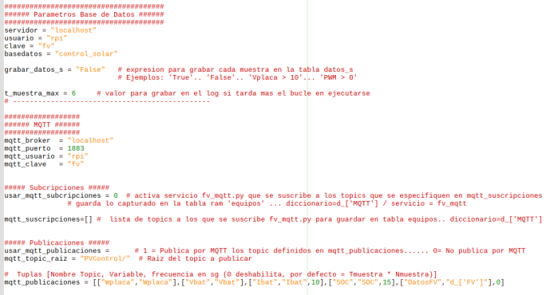

# Instalación SW 

- [Instalación SW](#instalación-sw)
  - [Introducción](#introducción)
  - [Configuración del sistema](#configuración-del-sistema)
    - [Acceso a la Raspberry](#acceso-a-la-raspberry)
      - [Monitor/Teclado/Raton](#monitortecladoraton)
      - [Acceso por VNC](#acceso-por-vnc)
      - [RPi conectada por cable Ethernet al Router](#rpi-conectada-por-cable-ethernet-al-router)
      - [RPi conectada por cable Ethernet directamente al PC](#rpi-conectada-por-cable-ethernet-directamente-al-pc)
      - [Incluir en la microSD desde el PC los archivos de conficguracion WIFI](#incluir-en-la-microsd-desde-el-pc-los-archivos-de-conficguracion-wifi)
    - [Expandir la tarjeta SD](#expandir-la-tarjeta-sd)
    - [WIFI](#wifi)
    - [IP](#ip)
  - [Actualizar a la última versión de PVControl+](#actualizar-a-la-última-versión-de-pvcontrol)
  - [Parámetros Instalación PVControl+](#parámetros-instalación-pvcontrol)
    - [*Sección principal*](#sección-principal)
    - [*SECCION PARAMETRIZACION SEGUN EQUIPAMIENTO INSTALADO*](#seccion-parametrizacion-segun-equipamiento-instalado)
    - [Pantallas OLED (OPCIONAL)](#pantallas-oled-opcional)
    - [*SECCION PARAMETRIZACION SERVICIOS ADICIONALES*](#seccion-parametrizacion-servicios-adicionales)
    - [TELEGRAM (OPCIONAL)](#telegram-opcional)
    - [CAMARA DE VIGILANCIA (OPCIONAL)](#camara-de-vigilancia-opcional)
    - [PVOUTPUT (OPCIONAL)](#pvoutput-opcional)
  - [ADAPTACION de la WEB](#adaptacion-de-la-web)
  - [Tabla parámetros en la Base de Datos](#tabla-parámetros-en-la-base-de-datos)

## Introducción

Marcaré en este color los puntos que **ES NECESARIO** revisar

Lo primero es cargar la imagen de PVControl+ en la microSD desde un PC

Hay muchos tutoriales en la web de cómo hacerlo,**por ejemplo usando la
utilidad raspberry pi image o la utilidad de balenaetcher**

-   https://www.raspberrypi.org/blog/raspberry-pi-imager-imaging-utility/

-   https://www.hwlibre.com/etcher/

En la imagen de PVControl+ ya viene básicamente todo preinstalado, pero
lógicamente hay que adaptar algunos parámetros a la instalación de cada
uno

**COMO SEGURIDAD MI CONSEJO ES GUARDAR UNA IMAGEN DE LA microSD EN EL PC
ANTES DE TRASTEAR, PARA PODER VOLVER A LA SITUACION INICIAL SIEMPRE QUE
SEA NECESARIO**

**UNA VEZ TENGAMOS LA INSTALACION FUNCIONANDO ES MUY RECOMENDABLE SACAR
PERIODICAMENTE UNA IMAGEN DE LA microSD PARA TENERLA COMO SEGURIDAD**

## Configuración del sistema

### Acceso a la Raspberry

Lo primero es poder acceder a la RPi para poder configurarla con los
datos de nuestra instalación (Wifi, etc)

<https://www.raspberrypi.org/documentation/remote-access/README.md>

Como veis hay varias formas, explico algunas:

#### Monitor/Teclado/Raton 

> Una forma muy cómoda y fácil de poder acceder a la RPi para
> configurarla es enchufarla a un Monitor/TV con entrada HDMI y usar un
> teclado/raton
>
> Si esta opción es posible, es la mas recomendable dado que siempre
> funcionara sin problemas

#### Acceso por VNC 

> VNC nos permite ver el escritorio de la RPi en un PC, y por tanto
> manejar la RPI como si se tuviera enchufado un Monitor/Teclado/Raton
>
> Para ello debemos instalar en nuestro PC un visor de VNC (VNCViewer
> por ejm)
>
> <https://www.realvnc.com/es/connect/download/viewer/>
>
> 
> 
> Una vez tengamos VNC Viewer instalado
> tendremos que decirle a que IP nos queremos conectar
>
> En la imagen de PVControl se ha puesto el siguiente usuario/clave:

-   **Usuario : pi**
-   **Clave: PVControl+**

> El valor de la IP a poner dependerá de cómo hemos conectado la RPi,
> veamos algunos ejemplos

#### RPi conectada por cable Ethernet al Router

> En este caso por ejm, podemos ver que IP ha sido asignada en el Router
> 
> 
>
> Una opción que muchas veces funciona es
> intentar conectar poniendo ..... **rpi.local**
>
> Otra opción es usar una App en un movil para ver los equipos
> conectados a nuestra LAN
>
> Yo utilizo Wifi Network Analyzer que permite esto además de ver la
> cobertura Wifi, pero seguro que hay muchas mas opciones
>
> <https://play.google.com/store/apps/details?id=com.pzolee.wifiinfo&hl=en_US>
> 
> 

#### RPi conectada por cable Ethernet directamente al PC

> Se puede probar una vez conectados si
> simplemente poniendo rpi.local se conecta
> 
>
>
> Si no funciona hay que analizar la configuración de la red creada en
> el PC.. si quieres usar esta opción busca por la web los muchos
> tutoriales que hay

#### Incluir en la microSD desde el PC los archivos de conficguracion WIFI

> Otra opción es incluir en la microSD la información de nuestra WIFI
> (SSID y Clave) , en este caso hay que considerar que la IP que viene
> por defecto en la imagen es 192.168.0.X (X puede ser 12, 14, 15. etc
> .dependiendo de la version de la imagen que se tenga), luego nuestra
> LAN debe estar en el rango 192.168.0.X para poder conectarse
>
> 
> 
> Hay que añadir desde el PC en la carpeta
> BOOT de la microSD el archivo "**wpa_supplicant.conf**" con esta
> estructura poniendo en el ssid y psk los valores de nuestra WIFI

### Expandir la tarjeta SD 

Una vez que nos podamos conectar a la Rpi, podemos iniciar la
configuración expandiendo la tarjeta microSD (en las últimas versiones
de las Raspberry **NO es necesario expandir la tarjeta** dado que se
autoexpande, en todo caso mirar la capacidad de la microsd con el
comando df -h para ver si coincide con el tamaño de la tarjeta)

La imagen realizada se puede poner en una SD de al menos 8GB...se
recomienda una de SD de 16GB o 32GB, por lo que una vez copiada la
imagen en la SD hay que expandir la tarjeta para asegurar que se utiliza
toda la capacidad disponible

Desde terminal se ejecuta:

```
sudo raspi-config
```

> opción Advanced 

> opción A1 

> Con esto la próxima vez que se reinicie ya se tendrá la capacidad
> completa de la tarjeta que podemos ver con el comando "df -h "
>
> 

### WIFI 

Si aun no lo hemos hecho en los pasos previos hay que dar de alta la red wifi que se tenga


### IP

La IP que tendrá la RPi será la que le proporcione el router cuando se
conecte por Wifi y/o cable

Si queremos una IP fija podemos establecerla en la propia Rpi o
asignarla en el router


Una vez conectada la Rpi con la IP correcta, se puede trabajar
perfectamente desde un PC externo con escritorio remoto como hemos
hablado anteriormente usando el programa VNCViewer en el PC

##  Actualizar a la última versión de PVControl+

1. Reiniciamos la Rpi

2. Abrimos ventana de terminal, vamos a la carpeta PVControl+ y actualizamos
    ```
    pi@rpi:~ $  cd PVControl+
    pi@rpi:~/PVControl+ $  git pull
    ```
    Se nos actualizarán los ficheros de PVControl+ con los últimos cambios que existan

**ESTE PASO DE ACTUALIZACION ES MUY IMPORTANTE**\
**HACERLO SIEMPRE** **ANTES** **DE EMPEZAR A CONFIGURAR PVControl+**

## Parámetros Instalación PVControl+

Para la configuración inicial que puede ser válida en muchos casos, se
puede ejecutar la aplicación" PVControl_Configuracion_Inicial.py"

Esta aplicación se puede ejecutar
directamente desde el escritorio haciendo doble click


Pulsar 1 y después la tecla ENTER para que nos salga el siguiente paso


1.  Se salta este paso y no se modifica el archivo de Parametros_FV.py
    que ya existe

2.  Usa el archivo Parametros_FV.py actual (se usa para cambiar el
    archivo previamente creado

3.  Si es la primera configuración de PVControl+

Introducimos la opción y pulsamos enter (las opciones que salen dependen
de los archivos de ejemplo que estén dados de alta con la versión de
PVControl+, elegir la que mas se adapte a la instalación FV que se tenga
o, en caso de duda, la genérica DIST)


**Nos avisa de que se abrirá el archivo Parametros_FV.py y de lo
importante que es configurarlo bien**

También realiza una copia de seguridad de archivo Parametros_FV.py que
exista

Pulsamos una tecla y se abrirá el archivo Parameros_FV.py en el editor
incluido con la Rpi llamado **Thonny**


**Dada su importancia veamos cada apartado de dicho archivo por
separado**

**Parametros_FV.py se divide en 3 secciones**

1.  **SECCION PRINCIPAL**

> **Permite configurar lo necesario para el funcionamiento del programa
> principal (fv.py)**

2.  **SECCION PARAMETRIZACION SEGUN EQUIPAMIENTO INSTALADO**

> **Permite configurar el distinto equipamiento que tenemos instalado
> (baterías, PCB de PVControl+, Hibrido tipo Axpert, Fronius, Huawei
> etc**

3.  **SECCION PARAMETRIZACION SERVICIOS ADICIONALES**

> **Permite configurar los distintos servicios adicionales disponibles
> en PVControl (Telegram, PVOutput, motionEye...**

### *Sección principal*

Simulación

Se dejara el valor por defecto a 0 salvo
que queramos que el programa se ejecute con datos simulados


Sensores


En esta parte se definen las formulas que describen como se capturara
cada variable (Vbat, Ibat etc)

En este sentido hay varias posibilidades:

-   **Equipos que ya se han actualizado para usar la tabla Equipos de la
    > Base de datos**

> En este caso la sintaxis es **d\_\['CLAVE'\]\['Variable'\]**
>
> Asi por ejemplo si queremos que Vbat se capture desde un Hibrido tipo
> Axpert la línea quedaría asi**:**
>
> **\'Vbat\' : {\'Equipo\':\"d\_\[\'HIBRIDO\'\]\[\'Vbat\'\]\",
> \'Max\':32, \'Min\':0},**
>
> Si no queremos que se controle el máximo y mínimo valor (mandando un
> log si el valor capturado se sale de dichos márgenes podemos
> simplificar quedando
>
> **\'Vbat\' : {\'Equipo\':\"d\_\[\'HIBRIDO\'\]\[\'Vbat\'\]\"},**
>
> **ATENCION a cada carácter { " , etc debe se exactamente como se
> indica para que funcione... no olvidar la coma final**
>
> Entre los equipos que a fecha actual usan este sistema están las
> siguientes claves ( programas que generan el registro en tabla
> equipos):

-   **ADS** (fv_ads.py) : Para el uso de los ADS1115 de la PCB de
    PVControl+

-   **HIBRIDO** (hibrido.py) : Captura de hasta 9 hibridos tipo Axpert

-   **CELDAS**: Captura los valores de la distintas celdas , existen
    varuios programas para este caso según como capturemos los valores

    -   fv_mux.py si se usa la PCB de PVControl+

    -   fv_daly.py: si se usa el BMS marca DALY

    -   fv_diybms.py: si se usa el BMS de diyBMS

-   **TEMP** (fv_temp.py) captura los valores de temperatura de los
    sensores DS18B20

-   **MQTT** (fv_mqtt.py) captura los topic MQTT que se definan

-   **SDM120C** (fv_sdm120c.py) : Capturas desde un sdm120C

-   **HUAWEI** (huawey.py): Capturas desde equipo Huawei

-   **FRONIUS** (fronius.py): capturas dede equipos fronius

-   **SI / SB** (si.py/sb.py): Capturas desde equipos SMA (Sunny Island
    y Boy)

-   **BMV** (bmv.py): capturas desde puerto serie de monitores baterías
    Victron

-   **Equipos que aun NO se han actualizado para usar la tabla Equipos
    > de la Base de datos** (puede que se actualicen posteriormente a la
    > edición de este manual, luego pruebe con la opción anterior si
    > esta no funciona**)**

> En este caso la sintaxis es **d_clave\['Variable'\]**
>
> Así por ejemplo si queremos que Vbat se capture desde un SMA la línea
> quedaría **:**
>
> **\'Vbat\' : {\'Equipo\':\"d_srne\[\'Vbat\'\]\", \'Max\':32,
> \'Min\':0},**
>
> Se iran cambiando progresivamente este tipo de programas para usar la
> tabla equipos
>
> A fecha de escritura de este manual estos son los programas que usan
> esta forma:

-   **victron** (victron.py) : capturas desde puerto serie de equipos
    Victron

-   **sma_meter** (sma_meter.py): capturas desde el meter de SMA

-   **goodwe** (goodwe.py): capturas desde equipos goodwe

-   **must** (must.py): capturas desde equipos must por modbus

-   **srne** (srne.py): capturas desde equipos srne

Por tanto, así quedaría esta parte en el caso de usar la PCB de
PVControl+ con el sensor de temperatura incluido en una instalación FV
aislada


En el caso de usar Hibrido tipo Axpert y además querer poner en
variables auxiliares capturas del equipo sdm120C quedaría:


Se permiten expresiones algebraicas, por lo que si tenemos dos Hibridos
y queremos sacar la Wplaca total se pondría:

```
....
'Wplaca' : {'Equipo':" d_['HIBRIDO']['Wplaca'] + d_['HIBRIDO1']['Wplaca']",
            'Max':4000, 'Min':0},
...
```
**Esta parte es vital y algo compleja luego se debe rellenar despacio y
con cuidado de poner la sintaxis bien**

**Para asegurar que, al menos, no hay errores sintácticos ejecutar desde
Thonny y ver que no da error**


*Base de datos y Broker MQTT*



Salvo que se sea usuario experimentado mejor no tocar la parte de Base
de datos

En la parte de MQTT se pueden definir tanto los topic a los que se
suscribe PVControl+ como los topic que publica

### *SECCION PARAMETRIZACION SEGUN EQUIPAMIENTO INSTALADO*

*Batería*

­

*ADS1115 (PCB PVControl+)*

Permite definir los distintos parámetros de captura de los conversores
analógico-digitales ADS1115 que utiliza la PCB de PVControl+ (data_rate,
ganancia,...)

**Lo habitual es solo tener que modificar res_ADS para poner los ratios
de los divisores de tensión que se han instalado en la PCB y los shunt
de medición de Ibat/Iplaca**


**ATENCION... si alguien va a medir una señal por encima de 110V por ejm
en Vplaca y no tiene claro cómo hacerlo que NO lo intente hacer\
\
Por favor mucho cuidado con manejar tensiones altas... que todo esté
perfectamente aislado y sin posibilidad de tocar por accidente\
Si no lo veis claro..mucho mejor quedarse sin medir Vplaca que tener un
accidente**

Un cuadro de valores que llegarían a la entrada del ADS y potencia
disipada en las resistencias dependiendo de la señal de entrada


*MUX (Medida de Vceldas de la PCB de PVControl+)*

Parametriza los MUX de la PCB de PVControl+ para la captura del valor de
voltaje de las celdas

-   Hasta 32 celdas en lectura simple

-   Hasta 16 celdas en lectura diferencial


> Usar esta funcionalidad nos permitirá ver distintas gráficas de la
> evolución de cada celda de la batería,por ejemplo en la pagina web
> "Inicio" se muestra el valor actual junto con el máximo y mínimo del
> día
>


Para la calibración de las capturas ejecutar desde terminal el programa
```
python3 fv_mux_calibracion.py
```


Equipos integrados en PVControl+

La lista de distintos equipos va creciendo con el tiempo

El concepto es similar para casi todos

-   usar_XXX = 1 para activar el servicio que captura los datos

-   dev_XXX = driver con el que reconoce la Rpi al equipo

-   t_muestra_XXX = 5 para capturar cada 5 sg los datos

-   mas otros campos que dependen de cada equipo (IP, etc)

Asi por ejemplo si queremos activar la lectura de un Hibrido pondremos:


**Los programas que permiten lectura de mas de un equipo del mismo tipo
se definen con listas \[xxx, yyy\], si solo permite un equipo se pondrá
el valor sin los \[\]**

Por ejemplo si queremos capturar valores de 2 Hibridos se pondría:


En este caso las capturas del primer hibrido serán cada 5 sg y del
segundo cada 10sg etc

El valor de hidrawX dependerá de donde lo reconoce la Rpi, por lo que
puede cambiar con cada instalacion

Ejemplos de distintos equipamientos


### Pantallas OLED (OPCIONAL)

En la PCB versiones 1.2 o superiores y 3.1 se pueden poner hasta dos
pantallas OLED

El programa reconoce automáticamente el número de pantallas instaladas


Se ha definido varios tipos de salida por
pantalla:

-   0: el Logo de PVControl+

-   1: SOC, Vbat, Ibat, Vplac, Iplaca y los reles

-   2: Otra forma de mostrar los valores de Vbat, Ibat...

-   3: Situación de los reles en detalle (con nombre..)

-   4: Valor del SOC en grande..si llega a 100% se pone iluminado el
    fondo

Podemos definir la secuencia de pantallazos que queremos en cada OLED
para que se vaya mostrando secuencialmente en esta parte


En este ejm la OLED 1 mostraría secuencialmente los pantallazos 0,1,2,3
y en la OLED 2 siempre mostraría el SOC en grande

Se permite cualquier secuencia tipo por ejm suponiendo que capturamos
datos cada 5 seg:

-   \[1,1,2\] mostraría durante 10seg la pantalla 1 y 5seg la 2

-   \[1,2,1,3\]...5 seg la 1, 5 seg la 2, 5 seg la 1, 5 seg la 3

-   ...

.

### *SECCION PARAMETRIZACION SERVICIOS ADICIONALES*

### TELEGRAM (OPCIONAL)

Aquí estableceremos si queremos o no usar Telegram


Yo recomiendo el uso de Telegram por lo que es lógico darse de alta y
crease un Bot

Hay muchos tutoriales de cómo crearse un Bot, pongo aquí un extracto
algo modificado, sacado de
<https://elandroidelibre.elespanol.com/2018/02/como-crear-tu-propio-bot-de-telegram.html>
(

1.  Lo que primero que tienes que hacer es dar constancia a Telegram de
    que quieres crear un nuevo Bot. Para ello tenemos que mandar un
    mensaje al **BotFather** (@BotFather), en concreto el de «/newbot».

2.  Posteriormente el propio bot te preguntará por el nombre que quieres
    para tu bot. Importante, tiene que acabar en Bot. Ejemplo: FV_Bot o
    Eal_Bot.

3.  Si todo está correcto, te verificará la creación de tu Bot.

4.  Ahora es el turno de configurar la privacidad de tu bot. Escribimos
    «/setprivacy» y posteriormente, el nombre de tu bot mencionándolo
    por su nombre «@Bot». El BotFather te responderá con las opciones y
    puedes hacer que sólo atienda a mensajes que lo mencionen o que
    empiecen por un «/» con el modo ENABLED. O recibir cualquier mensaje
    del grupo si marcamos la opción DISABLED... para PVControl+ hay que
    elegir la opción DISABLED.

5.  Bot creado....con /mybots nos salen opciones y podemos ver el TOKEN
    que se ha generado para nuestro Bot y que debemos poner en el
    fichero Parametros_FV.py

También debemos saber que ID tenemos, cada chat de Telegram tiene un ID,
por lo que nuestro usuario tendrá un ID, y si estamos en un grupo, dicho
grupo también tendrá un ID

Por tanto, podemos definir desde que chat se le van a poder mandar
ordenes a PVControl+, o a que ID se van a mandar los mensajes periódicos
etc

El ID es un numero que será positivo si corresponde a un chat personal,
o será un número negativo si es de un chat de grupo

Hay muchas formas de obtener el ID:

-   Por ejm
    <http://jejo.pw/post/2018/03/17/Obtener-nuestro-ID-de-telegram>

-   En mi caso uso mas el Bot llamado IDbot al que le podemos sacar
    fácilmente tanto el ID propio como de un grupo


Así, por ejemplo, en mi caso tengo un Grupo (formado por el Bot creado,
mis hijos y yo) donde mando los mensajes periódicos para que nos llegue
cada 30' el estado de la FV


Tengo otro Grupo donde me llegan las fotos/videos de alarma con la
cámara instalada (según veremos en el apartado siguiente), etc

Lo mínimo necesario es poner en el archivo Parametros_FV.py el ID propio

### CAMARA DE VIGILANCIA (OPCIONAL)


Se ha integrado en PVControl+ la posibilidad de utilizar una cámara para
poder capturar fotos y videos (no es obligatorio usarlo )

Para ello estamos utilizando el programa "motionEye" instalado en la RPi

Hay muchos tutoriales en la web del uso de motion por si alguien quiere
profundizar

En el caso de PVControl+, para evitar falsas alarmas también se ha
integrado el análisis de la foto capturada usando la Inteligencia
artificial que nos proporciona "clarifai", si queremos usar esta
característica de análisis por inteligencia artificial debemos darnos de
alta en Clarifai con una cuenta gratuita.

Esta característica es avanzada, no es muy difícil de usar, pero
requiere crearse un workflow e ir "enseñando" al la inteligencia
artificial con las fotos que se le manden, que consideramos alarma y que
no, un pequeño detalle de cómo se usa y como utiliza la capacidad de
reconocimiento de caras que tiene Clarifai lo veis aquí:

<https://adnsolar.eu/viewtopic.php?f=17&t=149&start=30#p6399>

En cualquier caso el uso de Clarifai no es obligatorio, aunque da un
"toque" curioso a la funcionalidad


Si tenemos instalada la cámara, además de solicitar fotos o configurarlo
via Telegram, tendremos un servidor web en el puerto 8765 de la IP de la
Rpi (http://IP_rpi:8765) en donde podremos ver la imagen y configurar el
programa motionEye

Los parámetros a configurar son los siguientes:


En horario_alarma se ha dividido cada día de la semana en 24 horas donde
podemos poner si la detección esta activada o desactivada

Si tenemos la cámara propia de la Rpi, los pasos a seguir son:

-   Asegurar que está activo el interface


> Si NO se tiene instalada la cámara hay que asegurarse de que dicha
> opción este desactivada... y además creo conveniente desactivar el
> programa motionEye con "sudo systemctl disable motioneye"
>
> Si posteriormente instalamos la cámara, podremos sin problemas activar
> el interface y activar el servicio motioneye

###  PVOUTPUT (OPCIONAL)

Aunque PVControl+ tiene una web propia con
gráficos etc, también se puede utilizar PVOutput que es una web
australiana que nos permite mandarle los datos de nuestra instalación
cada 5 minutos y tiene una gran cantidad de graficas, análisis, una app
para android, etc


Para utilizar esta capacidad hay que darse de alta en dicha web y
conseguiremos el TOKEN e id que debemos poner


Asegurarse de que en el archivo crontab se tiene la entrada marcada en
azul activa


Se puede modificar cambiando el archivo :

**/home/pi/PVControl+/etc/cron.d/pvcontrol**

> Para editar este archivo que utiliza crontab se debe utilizar el
> usuario "root", esto se puede hacer simplemente tecleando desde
> terminal
> ```
> sudo geany
> ```
> para abrir el editor de textos geany con capacidad para modificar
> archivos de root

Una vez que terminemos de configurar el archivo Parametros_FV.py lo
guardaremos y cerraremos Thonny para continuar con la instalación


En PVControl+ adicionalmente a la configuración del archivo
Parametros_FV.py existe en la base de datos una tabla llamada
"parametros" con diferentes campos para su configuración

La razón de estar en BD es que así se nos permite actualizar los valores
"en caliente" sin tener que reiniciar el programa (control excedentes ,
etc)


Iremos rellenando los distintos valores que nos pide de acuerdo a la
instalación FV que tengamos


Por último se necesita configura las paginas web para adaptarlas a la
instalación que se tenga (con o sin baterías, con o sin control de
celdas,...)


Si pulsamos 1 se iniciaran los servicios de acuerdo a la parametrizacion
seleccionada


**El proceso se ha completado...pulsamos INTRO para salir**

Con esto ya se debería poder ver la web funcionando correctamente y
monitorizando los datos simplemente con poner en el navegador la IP de
la Rasperry


Si queremos ajustar mas parámetros o nuestra instalación es algo mas
compleja (varios equipos distintos, etc) hay que editar el archivo
Parametros_FV.py ubicado en /home/pi/PVControl+ y cambiar lo que
queramos según lo explicad{width="2.6104166666666666in"
height="4.420833333333333in"}o

Asimismo si queremos personalizar la web (escala, valores y franjas de
colores de cada reloj,..) editaremos el archivo Parametros_Web.js
ubicado en /home/pi/PVControl+/html y cambiaremos lo que queramos

## ADAPTACION de la WEB 

Como hemos comentado las distintas páginas web creadas en PVControl+ se
pueden adaptar a los valores de cada instalación


Esta adaptación se puede hacer en un primer paso de forma cómoda
utilizando el programa descrito en el apartado 2.6 "Configuración
básica"

También se puede realizar una adaptación más ajustada a nuestra FV
editando el archivo Parametros_Web.js ubicado en
```
/home/pi/PVControl+/html
```
En dicho archivo podremos ir cambiando los valores que definen cada
grafico

PVControl+ usa las librerías gráficas de Highchart que hay documentación
de sobra en internet, luego si se quiere realizar cualquier tipo de
grafica es posible

## Tabla parámetros en la Base de Datos

Como se ha comentado, para mayor funcionalidad la parametrización de la
instalación de PVControl+ se ha dividido en tres partes

-   **Archivo Parametros_FV.py : según lo que hemos visto**

-   **Archivo de parámetros de la Web Parametros_Web.js**

-   **Tabla parametros en la Base de datos**

El concepto de cada uno de estos archivos es:

Si se modifica algo en el archivo **Parametros_FV.py** es conveniente
reiniciar la Rpi para que se active ( o dependiendo de la parte que se
modifique reiniciar uno o todos los servicios fv, fvbot y hibrido con
"sudo systemctl restart fv" por ejm para reiniciar el servicio fv)

Si se modifica algo en el archivo **Parametros_Web.js** se debe
refrescar la pagina web para ver los cambios

Sin embargo lo que se cambia en la tabla **parametros** de la Base de
Datos afecta inmediatamente sin necesidad de reiniciar

Esto nos permite ir cambiando valores "en caliente" y ver cómo reacciona

Veamos cuales son los campos que se pueden cambiar en la tabla
parámetros

Abrimos la tabla parámetros con phpmyadmin poniendo en el navegador

-   ip de la Rpi/phpmyadmin

-   usuario/clave es rpi/fv


accedemos a la tabla parámetros pulsando sobre "examinar

y vemos lo siguiente:


-   grabar_datos: Poniendo S o N grabaremos o no en la tabla "datos" las
    capturas de los valores

-   grabar_reles: Poniendo S o N grabaremos o no los cambios de estado
    de los reles

-   t_muestra: define el tiempo entra cada muestra, en el caso de usar
    un hibrido no se recomienda valores por debajo de 4 o 5 seg dado la
    lenta respuesta de su interfaz USB

-   n-muestras_grab: se define cada cuantas muestras se grabara los
    valores en la tabla datos, asi por ejm :

    -   t_muestra=2 y n_muestras_grab=3: se capturan los datos cada 2
        seg y se almacenran cada 6 seg

    -   t_muestra=1 y n_muestras_grab=5: se capturan los datos cada 1
        seg y se almacenaran cada 5 seg (esta es la configuración que yo
        tengo capturando desde los ADS) para tener un control de
        excedentes que reaccione rápido

    -   ....

> **Si queremos hacer un análisis de detalle por algún tiempo**, podemos
> hacer que se guarden todas las capturas a una velocidad de t_muestra
> **definiendo en Parametros_FV.py la variable "grabar_datos_s" a una
> condición que se cumpla cuando queramos grabar los datos a alta
> velocidad**
>
> **En ese caso se guardaran las capturas en la tabla "datos_s" cada
> t_muestra y, como siempre, en la tabla "datos" cada
> "t_muestra\*n_muestras"**
>

>
> La grafica Hist_8h coge los datos de la tabla datos_s
>
> La grafica Hist_1 coge los datos de la tabla datos
>
> La grafica Hist_3 y Hist_mes cogen los datos de la tabla datos-c (la
> tabla datos_C es una tabla resumen que se crea automáticamente desde
> la tabla datos en donde se guarda un registro cada 5 minutos
>
> **...**

-   nuevo_soc: si ponemos un valor distinto a cero, se actualizara el
    SOC de la instalación FV

-   objetivo_PID: se indica el valor a conseguir por el control de
    excedentes

-   sensor_PID: se indica la variable que se utiliza para el control de
    excedentes (Vbat, Vplaca, Ibat, etc)

-   Kp , Ki, Kd: se indica las constantes del control PID que se utiliza
    para controlar los excedentes

-   Vabs , Vflot y Tabs: se consigna el valor de Absorción, Flotación y
    el Tiempo de Absorción para la carga de la batería

-   Modo_Bat: Nos indica el estado de carga de la Bateria (BULK, ABS,
    FLOT..) .. se puede cambiar manualmente pero normalmente será
    actualizado automáticamente por PVControl+

-   Vequ, Tequ: Voltaje y tiempo de ecualización de baterias\
    **Sin implementar actualmente**\
    No obstante si se quiere ecualizar simplemente cambiar el valor de
    Vabs o Vflot a que se desee

-   Icola: para futuros usos

-   Coef_temp: para futuros usos

Asi pues, si se consigna Vbat como "sensor_PID" y ponemos ir cambiando
dinámicamente el valor objetivo a conseguir

**Esta característica es muy potente y nos permite incluso poder
controlar la carga de las baterías a nuestro antojo con excedentes
independientemente de los reguladores que tengamos simplemente poniendo
el valor de flotación y absorción en los reguladores a un valor algo
superior al que consignemos en PVControl+**

Si tenemos la posibilidad de usar Telegram, los datos de la tabla
parámetros se pueden actualizar mandando un mensaje


Con todo esto el control de carga y de excedentes es más que aceptable
como se puede ver en la curva diaria de carga en donde se aprecia
perfectamente cómo se va adaptando la señal PWM a la potencia disponible
en las placas


**PVControl+ permite usar y controlar cualquier número de relés locales
o via wifi**

En el caso de usar excedentes, lo mas lógico es usar reles SSR para
poder encenderlos en un % y que se adapten bien a la energía sobrante
disponible.... En el caso de la grafica de arriba se esta usando 3 reles
con SSR (Termo agua, calefactor1, calefactor2)


