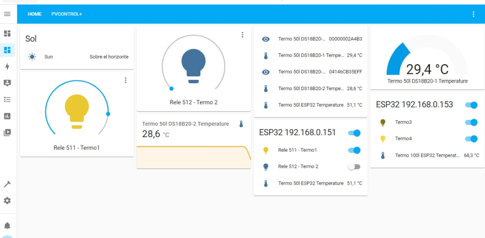
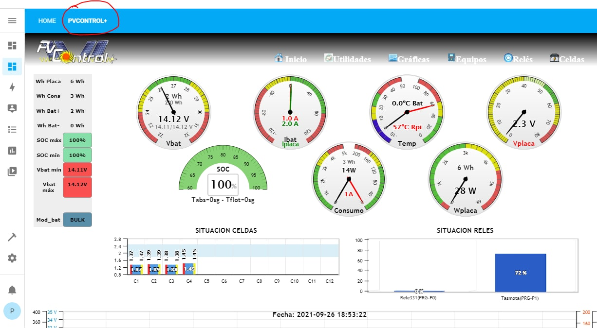
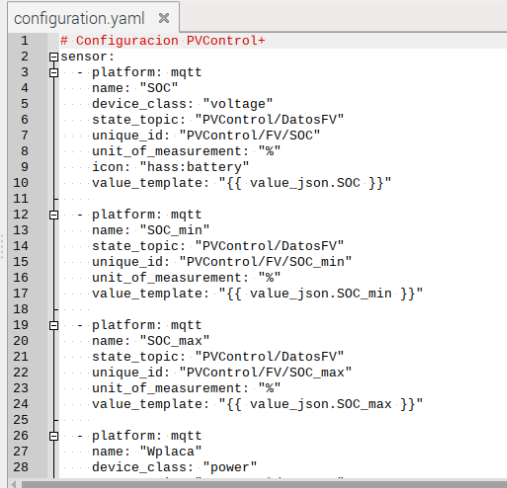

# Integración con Home Assistant 

La imagen actual de PVControl+ no lleva preinstalado Home Assistant (HA)
para ahorrar espacio y disminuir el tamaño del fichero de la imagen.

la instalación es muy simple de hacer si se quiere activar HA ya que
corre en docker por lo que simplemente ejecutaremos:

-   **python3 PVControl_Instalacion_HomeAssistant.py**

que ejecutará el comando docker para la descarga y puesta en marcha de
hA

Una vez activado podremos acceder a HA desde el navegador con la **IP de
la Raspberry en el puerto :8123**

**HA tiene muchos tutoriales y manuales por la web, por lo que se
recomienda su uso**

**Se ha realizado una pequeña integración HA-PVControl y, por ejemplo,
se puede ver la web de PVControl+ en la pestaña PVCONTROL+ creada**

También**, a través de MQTT**, se pueden pasar a HA los valores
capturados por PVControl+ , por ejemplo se incluye unos ejemplos de
integración usando el **archivo configuration.yaml ubicado en la carpeta
/home/pi/PVControl+/HA**

**Es necesario que los topic MQTT que publica PVControl+ y a los que se
suscribe HA se llamen igual, luego comprobar que lo que se define en
Parametros_Fv.py y configuration.yaml es congruente**