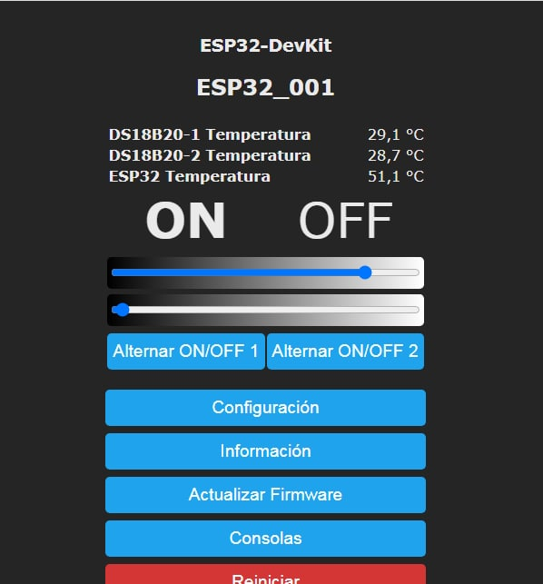
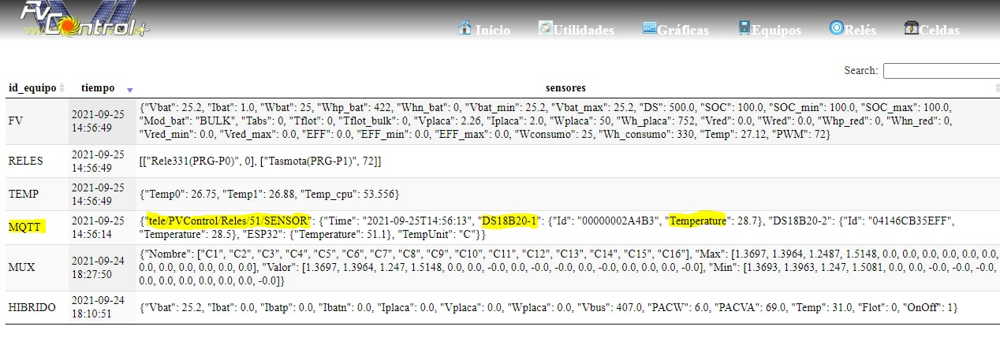

# Integración Tasmota

Otra integración realizada en PVControl+ ha sido poder utilizar los
ESP32/ESP01 con TASMOTA tanto para controlar reles como para poder leer
los sensores que se les pongan

Tasmota a su vez se integra bastante bien con HA, por lo que hay muchas
posibilidades de utilización

Igualmente para la programación y uso de Tasmota hay muchos tutoriales
en la web y, además, **se ha editado un manual especifico para su uso
dentro de PVControl+**

