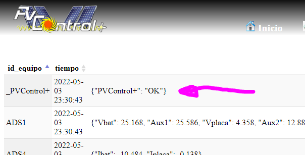
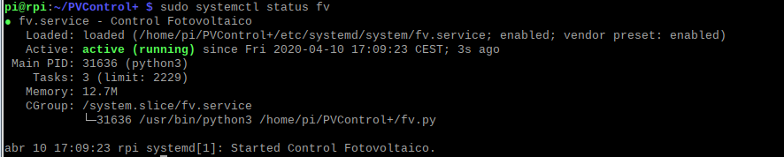
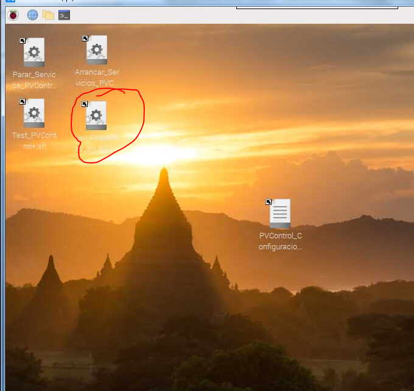
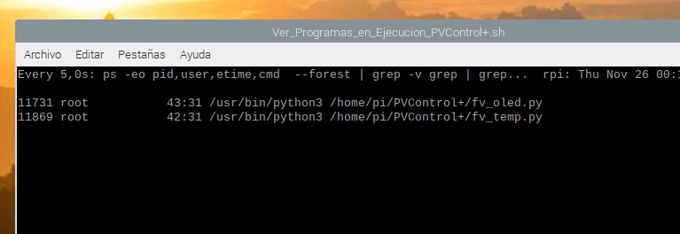
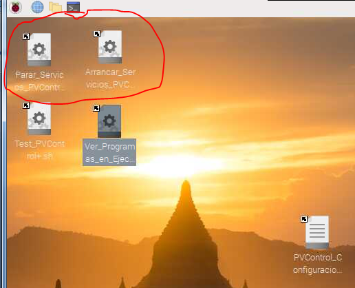
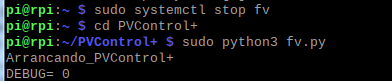

# Test y Resolución de Problemas

Lo primero que hay que hacer una vez parametrizado PVControl+ es
comprobar que esta funcionando correctamente en la web **pestaña
Equipos/Equipos**

Además esta pestaña nos dará información del estado de captura de los
distintos equipos configurados, por lo que es una buena forma de
identificar la mayoría de los problemas

Si ya se necesita un análisis mas avanzado, se puede ver el estado de
los distintos servicios activos usando el comando "sudo systemctl status
XXXX" para ir viendo la situación de cada servicio, por ejemplo para el
servicio principal "fv" sería:

-   `sudo systemctl status fv`
 
    

**Igual con el resto de los servicios principales:**

-   `sudo systemctl status hibrido` si se esta usando un Hibrido

-   `sudo systemctl status fvbot` si se esta usando un bot de Telegram

-   `sudo systemctl status fv_temp` si se esta usando un sensor de
    temperatura

-   `sudo systemctl status fv_oled` si se esta usando unas pantallas
    OLED con la PCB

-   `sudo systemctl status fv_mux` si se esta usando el multiplexor de
    la PCB

-   **....**

**También se puede usar el pequeño programa
que se ha puesto en el escritorio para listar los programas de
PVControl+ activos**

**Si el programa fv.py no esta ejecutándose, PVControl+ no estará
funcionando y por ejemplo la web no se actualizara**

> Por tanto lo primero es ver si hemos parametrizado correctamente el
> fichero Parametros_FV.py, cada vez que se cambia algo en dicho fichero
> y se guarda es mas seguro reiniciar los servicios con

-   `sudo systemctl restart fv`
-   `sudo systemctl restart hibrido`
-   .....

**También se puede utilizar una pequeña utilidad que se ha puesto en el
escritorio para parar o reiniciar todos los programas de PVControl+**

Si una vez se ha repasado (varias veces) que las instalación y
parametrizacion se ha hecho correctamente y PVControl+ sigue sin
funcionar lo mejor es parar el servicio y ejecutarlo de forma manual
para ver donde está el fallo

**Para ello los pasos son:**

**1.- Parar el servicio fv ....... sudo systemctl stop fv**

**2.- Ir a la carpeta /home/pi/PVControl+**

**3.- Ejecutar ...... sudo python3 fv.py**

**4.- Ver lo que sale y actuar en consecuencia (arreglándolo o llamando
a quien sabe cómo arreglarlo )**

